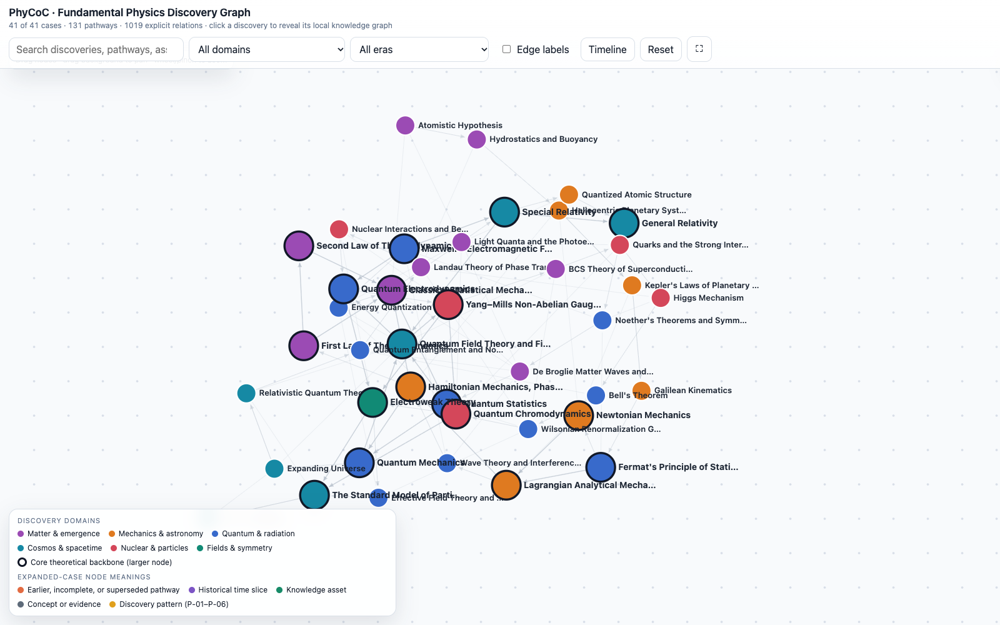
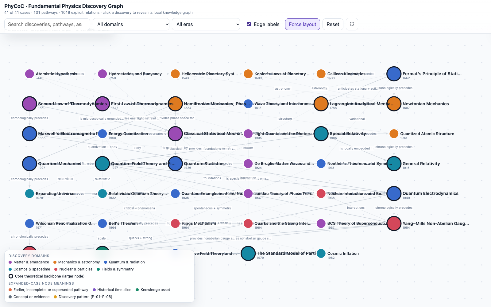
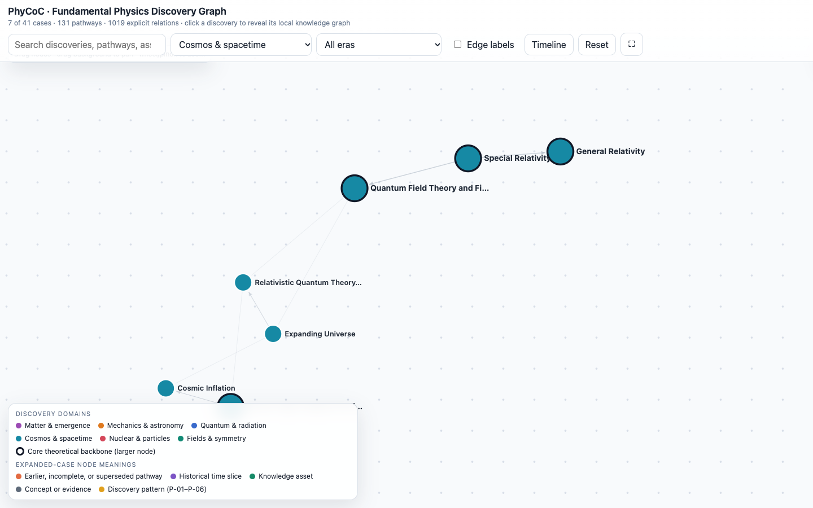
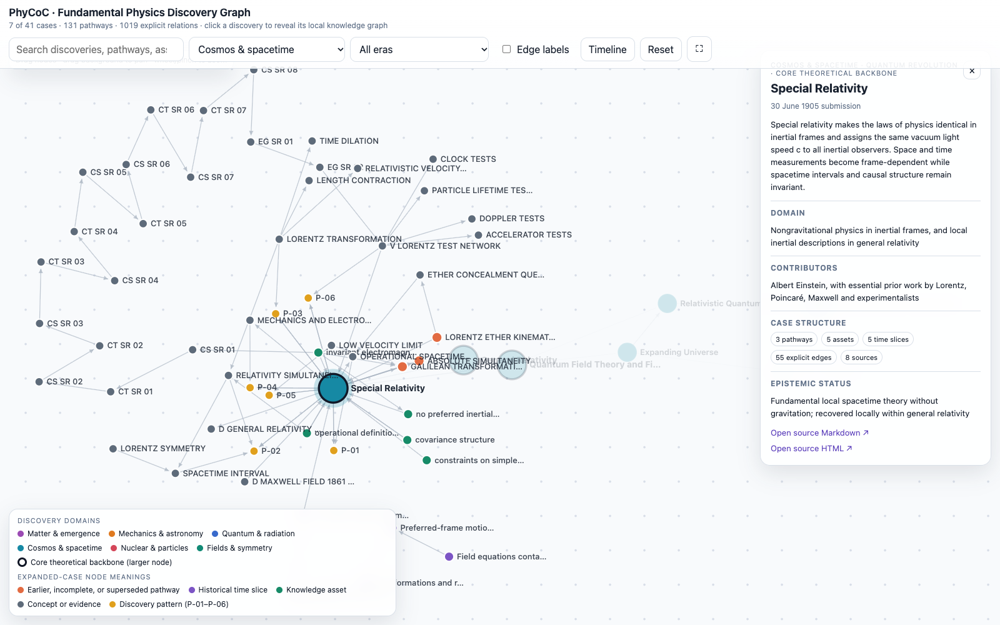
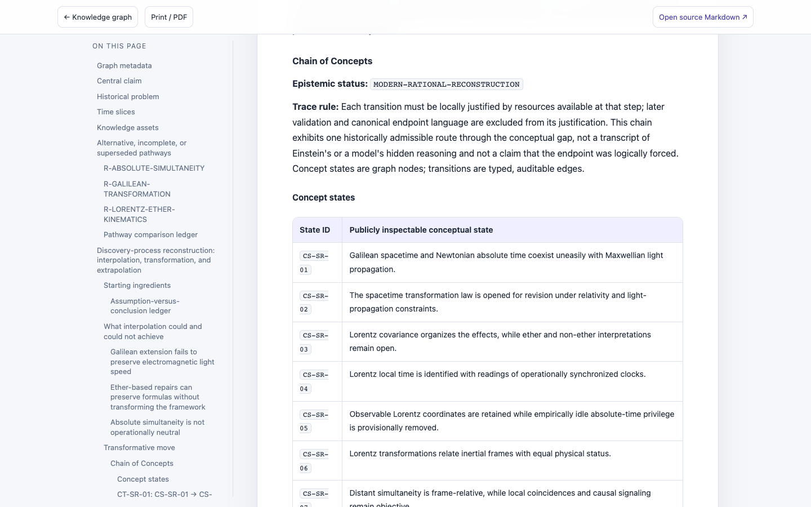
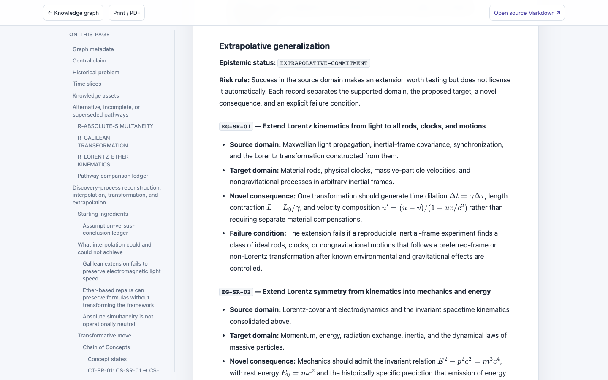

# PhyCoC: Chain of Concepts in Fundamental Physics Discoveries

PhyCoC is a source-grounded corpus and interactive graph of **41 theory-centered discoveries in fundamental physics**. It reconstructs how a scientific community could move from available concepts and evidence to a new explanatory structure, while keeping competing routes, later tests, and unresolved questions visible.

The long-term research goal is to help discovery-oriented AI **propose new conceptual shifts and disciplined extrapolations**, not merely reproduce the historical answers in this corpus. The historical cases are examples for studying and evaluating those operations; completing a case template is not evidence that an AI can independently discover a new theory.

## Preview

Explore the [live knowledge graph](https://phy-coc.vercel.app/) or open the [special-relativity case](https://phy-coc.vercel.app/case_pages/17_special_relativity.html). Click a screenshot to view it at full size.

| Full discovery graph | Timeline with edge labels |
|:---:|:---:|
| [](assets/screenshots/overview-graph.png) | [](assets/screenshots/timeline-edge-labels.png) |
| Cosmos and spacetime filter | Special relativity expanded into its local branches |
| [](assets/screenshots/knowledge-graph.png) | [](assets/screenshots/expanded-special-relativity.png) |

| Chain of Concepts in the case reader | Extrapolative generalization in the case reader |
|:---:|:---:|
| [](assets/screenshots/concept-chain.png) | [](assets/screenshots/extrapolative-generalization.png) |

## What a case contains

Each case begins with a dated problem and the knowledge available at that time. It then records plausible predecessor pathways and why their successes were insufficient. The discovery-process reconstruction has three distinct layers:

1. **Interpolation limits:** what could be repaired within inherited assumptions, and what remained unexplained.
2. **Chain of Concepts (CoC):** inspectable concept states (`CS-*`) connected by locally justified transformations (`CT-*`). Each transition records its input, pressure, protected result, changed assumption, operation, output, justification, cost, and next question. Branches are retained when the evidence did not yet select one answer.
3. **Extrapolative generalization:** after a new structure is formally consolidated, `EG-*` records state its supported source domain, risky target domain, novel consequence, and failure condition.

Cases also distinguish contemporaneous predictions from retrodictions and later validation; explain mathematical scope and limiting behavior; list directed graph edges; and cite primary or authoritative sources. A CoC is a **modern, historically constrained reconstruction**, not a transcript of a scientist's private thought or proof that the accepted endpoint was inevitable. Modern equations are marked as consolidations where appropriate.

For the full field definitions and a reusable writing template, see the [Chinese template guide](fundamental_physics_discoveries/DISCOVERY_TEMPLATE_GUIDE_ZH.md). The [corpus guide](fundamental_physics_discoveries/README.md) contains the ordered list of all 41 cases, inclusion criteria, schema, and data contract. [Special relativity](fundamental_physics_discoveries/17_special_relativity.md) is a useful entry point for seeing a conceptual reinterpretation separated from a merely formal transformation.

## Explore the corpus

- Open [`index.html`](index.html) for the interactive cross-case graph. Its nodes and links are generated from the Markdown corpus.
- Read a case in Markdown under [`fundamental_physics_discoveries/`](fundamental_physics_discoveries/) or in the corresponding rendered page under [`case_pages/`](case_pages/). The rendered pages include navigation and typeset equations.
- Check [`QA_REPORT.md`](fundamental_physics_discoveries/QA_REPORT.md) for the **41/41 dated internal case sign-offs**, corrections, and case-specific source limits. Internal editorial approval is not independent historian review.
- See [`discovery_eval/`](discovery_eval/) for six frozen historical-turn tasks, a scoring protocol, and pilot audits. No independent model-comparison result or discovery-capability claim is reported there.

The 41 canonical cases are numbered by focal discovery chronology, from ancient atomism to cosmic inflation. They emphasize generative laws, models, formalisms, mechanisms, and conceptual transformations rather than stand-alone detections or confirmations. Some cases, such as BCS superconductivity and Wilsonian RG, are included for foundational theory-building significance even though they connect to condensed-matter physics; the corpus is not a general materials-discovery database.

## Repository layout

| Path | Purpose |
|---|---|
| [`fundamental_physics_discoveries/`](fundamental_physics_discoveries/) | Canonical case Markdown, corpus documentation, chronology data, validator, and review ledger |
| [`case_pages/`](case_pages/) | Generated HTML case readers |
| [`index.html`](index.html) | Generated interactive graph and static-site entry point |
| [`discovery_eval/`](discovery_eval/) | Frozen pilot inputs, rubric, and audit notes |
| [`build_case_pages.mjs`](build_case_pages.mjs) | Generate case readers from Markdown |
| [`build_interactive_graph.mjs`](build_interactive_graph.mjs) | Generate the interactive graph from Markdown |

## Rebuild and validate

From the repository root, with Node.js available:

```bash
node fundamental_physics_discoveries/validate_corpus.mjs
node build_case_pages.mjs
node build_interactive_graph.mjs
git diff --check
```

The graph is a static page with no runtime package installation. Case readers load MathJax 3.2.2 from jsDelivr for equation typesetting; their text remains readable without that script. The repository can be hosted as a static site with `index.html` at its root and no build command.

## Scope and research status

PhyCoC is an **auditable knowledge and evaluation resource**, not a validated autonomous scientist. Sources do not turn every sentence into a claim-level citation; some original texts are inaccessible or require interpretation, and the [QA ledger](fundamental_physics_discoveries/QA_REPORT.md) states those limits. All 41 cases have passed structural validation and internal editorial review, but independent historical review and controlled, held-out model evaluation remain separate future steps. Historical answer recognition—especially from pretrained models—must not be scored as novel discovery.
